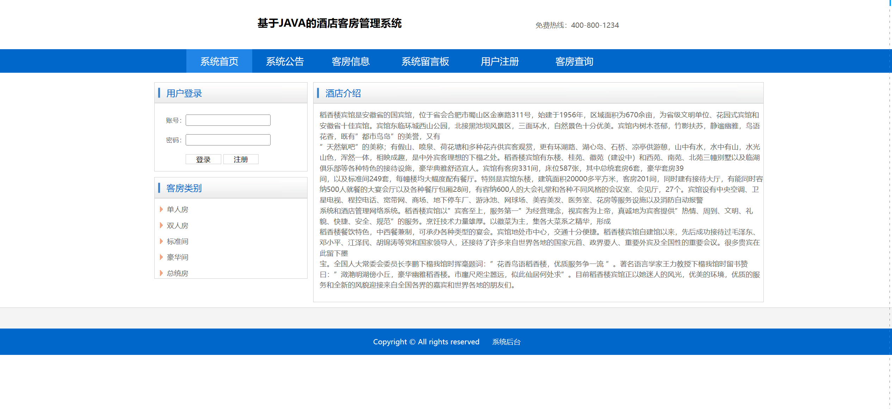
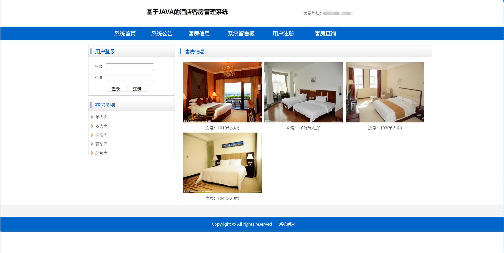
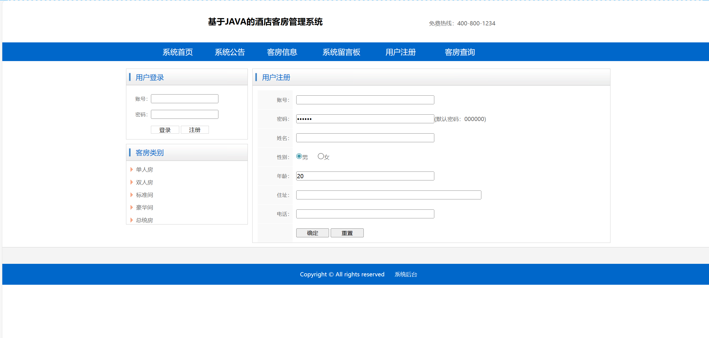
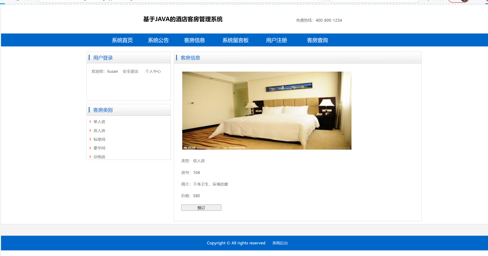
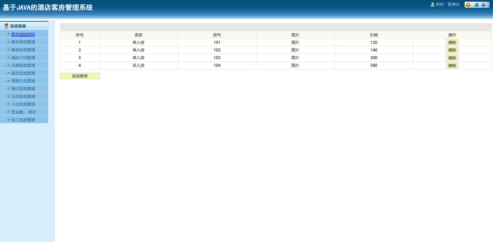
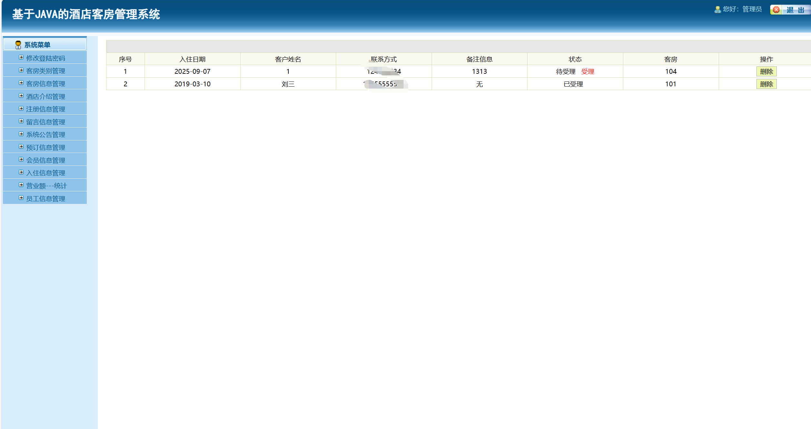
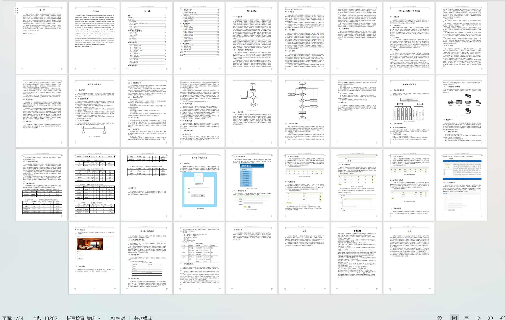

# jspServlet032
jspServlet032酒店客房管理系统+BG
 
## 源码问题查看主页咨询

### 一、关键词

酒店客房管理系统，酒店系统

### 二、作品包含
源码+数据库+设计报告文档+全套环境和工具资源+本地部署教程

### 三、项目技术
前端技术：Html、Css、Js、Jquery、Bootstrap
后端技术：Java、JSP、Servlet、JDBC

### 四、运行环境（以下版本亲测，其他版本兼容性请自行测试）
开发工具：IDEA/eclipse

数据库：MySQL5.7或8.0

服务器：Tomcat8.5或Tomcat9.0

数据库管理工具：Navicat10以上版本

环境配置软件： JDK1.8

浏览器：谷歌浏览器

### 五、项目介绍
项目编号：jspServlet032

现如今的社会，计算机技术正在迅速的发展中，而且应用在了社会的各个领域中，在每个行业都有广泛的普及和使用，越来越发挥着非常重要的作用，给人类带来了很大的方便与快捷。计算机强大的功能也被人们深刻的认识到，可以说信息化时代已经来临。此次毕设题目是酒店管理系统的开发，是为了酒店信息的综合性管理进行设计的，目的是改变以往的手工管理模式，使之信息的管理更进一步规范和方便，工作效率呢也得到了很好的提升，减轻了工作负担，同时也大大的降低了出错率。

用户：进入前台网站，主要包括系统首页，浏览客房信息，浏览系统公告，用户注册，登陆，在线订房，留言板留言和查看相关的信息。
管理员：系统管理员通过正确的账号密码进行登录系统后台，其主要功能包括修改密码，客房类别管理，系统公告管理，客房信息管理，预订信息管理，客人入住管理，注册用户等功能模块。

### 六、运行截图

